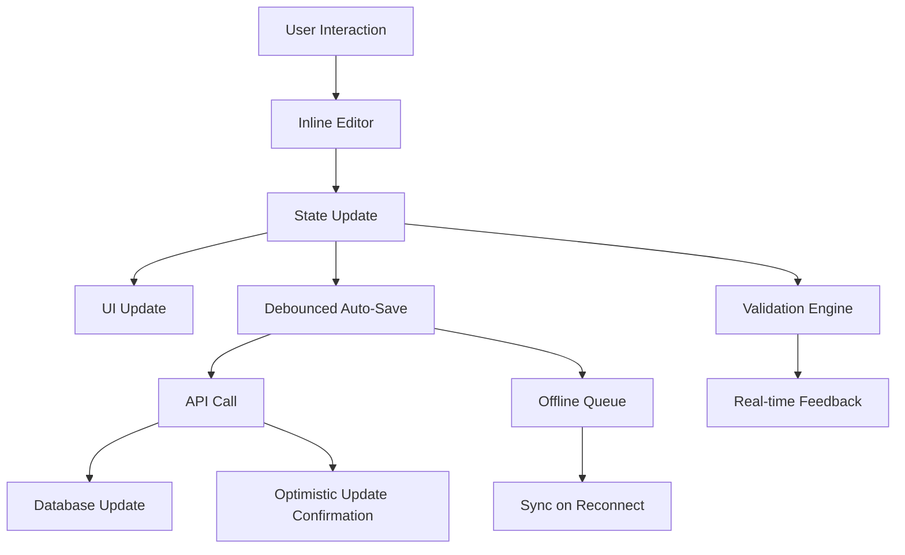

# Design Document

## Overview

The Editable Review Interface transforms the existing customer preview layout (currently shown in the "Customer Preview" tab) into a fully editable interface. Instead of displaying a static preview of how the offering will look to customers, users can click directly on any element within the customer-facing booking page layout and edit it inline.

This approach takes the existing preview structure - with its header, image gallery, trip info, highlights, pricing sidebar, etc. - and makes each section directly editable while maintaining the exact visual appearance customers will see. Users edit within the actual booking page layout rather than in separate forms.

## Architecture

### Transformation of Existing Preview

The current ReviewStep component already contains the complete customer-facing layout. The transformation involves:

1. **Wrap existing elements** with editable functionality
2. **Add click handlers** to switch between view and edit modes
3. **Implement auto-save** for seamless data persistence
4. **Add visual indicators** for editable areas

### Component Structure

```
EditableCustomerPreview/
├── EditableCustomerPreview.tsx       # Enhanced version of current preview
├── components/
│   ├── EditableText.tsx              # Inline text editing wrapper
│   ├── EditableRichText.tsx          # Rich text editing for descriptions
│   ├── EditableImageGallery.tsx      # Click-to-edit image gallery
│   ├── EditablePricingSidebar.tsx    # Inline pricing editor
│   ├── EditableHighlights.tsx        # Editable highlights/amenities list
│   ├── EditablePickupLocations.tsx   # Inline pickup location editor
│   └── EditingIndicator.tsx          # Visual cues for editable areas
├── hooks/
│   ├── useAutoSave.ts                # Auto-save with debouncing
│   ├── useInlineEdit.ts              # Edit mode state management
│   └── useClickOutside.ts            # Handle click-outside to save
└── utils/
    ├── debounce.ts                   # Debouncing utility
    └── editableHelpers.ts            # Helper functions for inline editing
```

### Specific Editable Areas

Based on the current preview layout, these sections become directly editable:

1. **Offering Title** (`h1` with offering name) → Click to edit inline
2. **Description** (large paragraph) → Click to open rich text editor
3. **Location** (MapPin icon + text) → Click to edit/select location
4. **Duration** (Clock icon + text) → Click to edit duration
5. **Image Gallery** → Click images to upload/replace/reorder
6. **Trip Highlights** → Click list items to edit, add/remove highlights
7. **What's Included** → Click amenities to edit, add/remove items
8. **Pickup Locations** → Click locations to edit times/addresses
9. **Pricing** (sidebar) → Click prices to edit pricing tiers
10. **Contact Info** → Click phone/email to edit contact details

### State Management

The interface uses a centralized state management approach with the following key principles:

1. **Single Source of Truth**: All offering data is stored in a single state object that mirrors the final database structure
2. **Optimistic Updates**: Changes are applied immediately to the UI while being saved in the background
3. **Conflict Resolution**: Handle concurrent editing scenarios with last-write-wins strategy
4. **Offline Support**: Queue changes when offline and sync when connection is restored

### Data Flow



## Components and Interfaces

### EditableOfferingView

The main container component that orchestrates the entire editing experience.

```typescript
interface EditableOfferingViewProps {
  initialData?: Partial<OfferingFormData>;
  mode: 'create' | 'edit';
  onPublish: (data: OfferingFormData) => Promise<void>;
  onSaveDraft: (data: OfferingFormData) => Promise<void>;
}

interface EditingState {
  activeSection: string | null;
  isDirty: boolean;
  lastSaved: Date | null;
  validationErrors: ValidationError[];
  isAutoSaving: boolean;
}
```

### EditableSection

A wrapper component that provides inline editing capabilities to any content section.

```typescript
interface EditableSectionProps {
  id: string;
  value: any;
  onChange: (value: any) => void;
  validator?: (value: any) => ValidationError[];
  editComponent: React.ComponentType<any>;
  displayComponent: React.ComponentType<any>;
  placeholder?: string;
  required?: boolean;
}
```

### InlineTextEditor

Handles simple text editing with immediate preview.

```typescript
interface InlineTextEditorProps {
  value: string;
  onChange: (value: string) => void;
  placeholder?: string;
  maxLength?: number;
  multiline?: boolean;
  className?: string;
}
```

### Auto-Save Hook

Manages automatic saving with debouncing and error handling.

```typescript
interface UseAutoSaveOptions {
  delay: number; // Debounce delay in milliseconds
  onSave: (data: any) => Promise<void>;
  onError: (error: Error) => void;
}

interface UseAutoSaveReturn {
  save: (data: any) => void;
  isLoading: boolean;
  lastSaved: Date | null;
  error: Error | null;
}
```

## Data Models

### Offering Data Structure

The interface works with a unified data structure that represents the complete offering:

```typescript
interface OfferingData {
  id?: string;
  businessType: BusinessType;
  productType: ProductType;
  basicInfo: {
    name: string;
    description: string;
    location: string;
    duration: number;
  };
  productConfig: {
    amenities: string[];
    pickupLocations?: PickupLocation[];
    groupSize?: GroupSizeConfig;
  };
  scheduling: {
    scheduleType: ScheduleType;
    timezone: string;
    availability?: AvailabilityConfig;
  };
  pricing: {
    currency: string;
    basePricing: PricingTiers;
    taxRate?: number;
    freeCancellationHours?: number;
  };
  media: {
    images: ImageData[];
    seoData: SEOData;
  };
  status: 'draft' | 'published' | 'scheduled';
  publishedAt?: Date;
  scheduledFor?: Date;
}
```

### Validation Error Structure

```typescript
interface ValidationError {
  field: string;
  message: string;
  severity: 'error' | 'warning';
  section: string;
}
```

## Error Handling

### Auto-Save Error Recovery

1. **Network Errors**: Queue changes locally and retry when connection is restored
2. **Validation Errors**: Show inline feedback without blocking the user
3. **Conflict Resolution**: Implement optimistic locking with conflict detection
4. **Data Loss Prevention**: Maintain local backup of all changes

### User Feedback

- **Success Indicators**: Subtle checkmarks and "Saved" timestamps
- **Error States**: Inline error messages with suggested actions
- **Loading States**: Minimal spinners during auto-save operations
- **Offline Mode**: Clear indication when working offline

## Testing Strategy

### Unit Testing

- **Component Testing**: Test each editable component in isolation
- **Hook Testing**: Verify auto-save, validation, and state management hooks
- **Utility Testing**: Test debouncing, validation rules, and data transformations

### Integration Testing

- **End-to-End Editing**: Test complete offering creation workflow
- **Auto-Save Scenarios**: Test various save/failure/recovery scenarios
- **Validation Flow**: Test real-time validation and error handling
- **Cross-Device Testing**: Ensure consistent experience across devices

### Performance Testing

- **Auto-Save Performance**: Measure debouncing effectiveness and API call frequency
- **Large Content Handling**: Test with extensive descriptions and many images
- **Memory Usage**: Monitor for memory leaks during extended editing sessions

## Implementation Considerations

### Complexity Comparison

**Current Multi-Step Approach:**
- ✅ Clear separation of concerns
- ✅ Familiar wizard pattern
- ❌ Complex state synchronization between steps
- ❌ Context switching between form and preview
- ❌ Difficult to maintain form state consistency

**Proposed Editable Review Approach:**
- ✅ Immediate visual feedback
- ✅ Simplified state management (single source of truth)
- ✅ Better user experience (WYSIWYG)
- ✅ Reduced cognitive load
- ❌ More complex individual components
- ❌ Requires sophisticated inline editing implementation

### Technical Benefits

1. **Reduced State Complexity**: Single state object instead of step-by-step state management
2. **Better UX**: Users see exactly what customers will see
3. **Faster Iteration**: No need to navigate between steps to make changes
4. **Auto-Save**: Eliminates manual save actions and data loss concerns

### Implementation Challenges

1. **Inline Editing Complexity**: Each editable section needs custom editing UI
2. **Mobile Responsiveness**: Touch-friendly editing controls
3. **Performance**: Real-time validation and auto-save optimization
4. **Accessibility**: Ensuring screen readers can navigate editing states

### Migration Strategy

1. **Phase 1**: Implement core editable components and auto-save infrastructure
2. **Phase 2**: Replace current ReviewStep with new EditableOfferingView
3. **Phase 3**: Add advanced features like offline support and conflict resolution
4. **Phase 4**: Optimize performance and add comprehensive testing

The editable review interface approach would likely be **less complex overall** than the current multi-step wizard, despite requiring more sophisticated individual components. The elimination of step-to-step state management and the single source of truth approach should significantly reduce the cognitive overhead and maintenance burden.